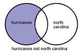
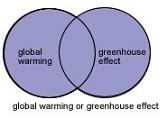

```{r setup, include=FALSE}
options(htmltools.dir.version = FALSE)
episode_counter <- 0
knitr::opts_chunk$set(
  collapse = TRUE,   
  comment = "#>",
  fig.retina = 3
)

```

```{r packages, include=FALSE}
library(countdown)
library(ymlthis)
library(gtsummary)
library(medicaldata)
library(gt)
library(tidyverse)
library(palmerpenguins)
library(xaringanExtra)
xaringanExtra::use_panelset()
xaringanExtra::use_share_again()
xaringanExtra::style_share_again(
  share_buttons = c("twitter", "linkedin", "pocket")
)

```

```{r broadcast, echo=FALSE}
xaringanExtra::use_broadcast()
```


class: title-slide, center, middle

<span class="fa-stack fa-4x">
  <i class="fa fa-circle fa-stack-2x" style="color: #ffffffcc;"></i>
  <strong class="fa-stack-1x" style="color:#e7553c;">`r rmarkdown::metadata$session`</strong>
</span> 

# `r rmarkdown::metadata$title`

## `r rmarkdown::metadata$subtitle`

### `r rmarkdown::metadata$author` &#183; Undergrad Research Training Program 

#### [`r params$site_link`](`r params$site_link`)


---
background-image: url(images/hello-red.jpg)
background-position: top center
background-size: 100%
class: middle, center


.pull-left[
### Instructor Name 
Instructor<br/>
CHIRAL Bangladesh<br/>
[<i class="fab fa-linkedin"></i> @linkedin_username](https://github.com/hossainlab)  
[<i class="fab fa-twitter"></i> @twitter_username](https://twitter.com/hossainlab)
]

.pull-right[
### Md. Jubayer Hossain <br/>
Lead Organizer & Instructor<br/>
CHIRAL Bangladesh<br/>
[<i class="fab fa-linkedin"></i> @hossainlab](https://github.com/hossainlab)  
[<i class="fab fa-twitter"></i> @JHossain_28](https://twitter.com/hossainlab)

]


.footnote[
Copyright &copy; 2022, [Md. Jubayer Hossain](https://jhossain.com/) and [CHIRAL Bangladesh](https://chiralbd.org/). All rights reserved. Use of these materials permitted only in accordance with license rights granted. This work is licensed under a [Creative Commons Attribution-NonCommercial-ShareAlike License](https://creativecommons.org/licenses/by-nc-sa/3.0/)]


---
# Agenda 
- Section 1 
- Section 2
- Section 3
- Section 4


---
class: middle, center, inverse

<span class="fa-stack fa-4x">
  <i class="fa fa-circle fa-stack-2x" style="color: #fff;"></i>
  <strong class="fa-stack-1x" style="color:#17a2b8;">`r (episode_counter <- episode_counter + 1)` </strong>
</span> 
--

# Section Title


---
# Slide Title 


---
# Column Divide 
.pull-left[
```{r, img1, echo=FALSE, fig.align='center', out.width="60%", out.height="40%", fig.cap="Figure: Image A"}

```

]

.pull-right[
```{r, img2, echo=FALSE, fig.align='center', out.width="60%", out.height="40%", fig.cap="Figure: Image B"}

```
]

---
# Footnotes and References 


The text<sup>1</sup>

.footnote[
[1] [Source: Google]()
]


---
# Tables 
| Operators | Description|  Example & Syntax	| 
|:--------|:---------|:-------------|
|Quotation marks (" ") | Results include the search terms when they appear as a phrase|  "cell phones"|
|Hyphen ( - ) | You can use the hyphen to indicate that words are strongly connected| smoking - cancer| 
|Hyphen ( - ) | You can use the hyphen to exclude words from a search query|cancer -adults|


---
# Images 

```{r, img3, echo=FALSE, fig.align='center', out.width="60%", out.height="40%", fig.cap="Figure: Image B"}

```
---
class: your-turn

# Your Turn


---
class: middle, center, inverse

# `r emo::ji("stopwatch")`

# Time for a break!

```{r echo = FALSE}
countdown(minutes = 5, update_every = 15)
```


---
class: middle, center, inverse

# `r emo::ji("heart")`

# Thank You
```

